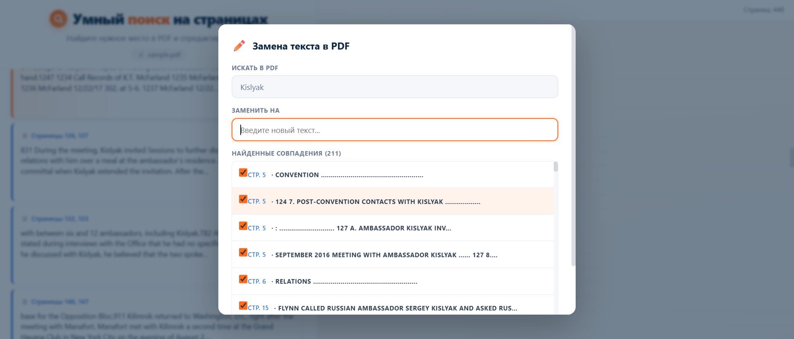

# Умный поиск на страницах

Семантический поиск по документам: ищет не по буквам, а **по смыслу**.  
Работает с **PDF, DOCX, TXT и Markdown**. Подсвечивает найденное прямо в документе
и позволяет заменить текст — всё в браузере.


---

## Возможности

- **Поиск по смыслу** — «штраф за просрочку» найдёт «пени за несвоевременную оплату»
- **Мультиязычность** — запросы на русском находят английский текст и наоборот
- **Четыре формата** — PDF, DOCX, TXT, MD; при загрузке тип определяется по расширению
- **Подсветка найденного** — в PDF выделяются жёлтые прямоугольники по координатам (bbox),
  в DOCX/TXT/MD — подсветка текста прямо в блоках
- **Замена текста** — выбор конкретных совпадений и подстановка нового текста
- **Скачивание результата** — отредактированный файл доступен сразу после замены
  в исходном формате (`edited.pdf`, `edited.docx`, `edited.txt`, `edited.md`)
- **Работа с любым документом** — загрузка своего файла до 100 МБ

## Как это работает

**Поток обработки:**

```
            ┌── PDF:  PyMuPDF → блоки с bbox
документ ───┤
            └── DOCX/TXT/MD: python-docx / чтение файла → блоки без bbox
                                    │
                                    ▼
                          чанкинг → эмбеддинги → FAISS
                                    │
                                    ▼
                              семантический поиск
                                    │
                    ┌───────────────┴───────────────┐
                    ▼                               ▼
              PDF: подсветка bbox           DOCX/TXT/MD: подсветка <mark>
                    │                               │
                    └───────────────┬───────────────┘
                                    ▼
                          замена текста (по точному вхождению)
```

**Детали:**

- **Чанкинг** — если в документе ≤ 1500 слов, каждый блок становится отдельным чанком
  (точечная подсветка). Иначе — окна по 500 слов с перекрытием 100.
- **Привязка к блокам** — каждый чанк несёт `block_refs: [[page, block_idx], ...]`,
  чтобы фронт подсветил только те блоки, из которых собран чанк.
- **Модель эмбеддингов** — `paraphrase-multilingual-MiniLM-L12-v2` (~470 МБ).
- **FAISS** — быстрый векторный поиск по чанкам (L2-расстояние).

**Стек:**

- **PyMuPDF** — извлечение текста с координатами из PDF
- **python-docx** — чтение DOCX
- **sentence-transformers** — эмбеддинги (мультиязычная модель)
- **FAISS** — векторный поиск
- **FastAPI** — HTTP-сервер
- **PDF.js** — рендеринг PDF и подсветка на фронтенде

---

## Быстрый старт

### Через Docker (рекомендуется)

```bash
git clone https://github.com/Dimon-art/smart-pdf-search.git
cd smart-pdf-search
docker compose up -d
```

Открыть **http://localhost:8000**

При первом запуске модель эмбеддингов скачается автоматически (~470 МБ).  
Дальше контейнер переиспользует кэш — стартует за 3–5 секунд.

Полезные команды:

```bash
docker compose logs -f          # логи
docker compose down             # остановить
docker compose up -d            # запустить в фоне
docker compose up -d --build    # пересобрать образ (после правок кода/фронта)
```

**Требования:** Docker Desktop с WSL 2.

---

### Вручную (для разработки)

**Требования:**

- Python **3.10+**
- ~1 ГБ свободного места (модель эмбеддингов ~470 МБ)
- Git

**Установка**

```bash
# Клонировать
git clone https://github.com/Dimon-art/smart-pdf-search.git
cd smart-pdf-search

# Создать окружение
python -m venv venv
venv\Scripts\activate          # Windows
# source venv/bin/activate     # macOS / Linux

# Установить зависимости
cd backend
pip install -r requirements.txt

# Из папки backend
uvicorn main:app --reload --port 8000
```

Открыть **http://127.0.0.1:8000**

---

## Скриншоты

**Поиск с подсветкой:**


**Замена текста:**



---

## Поддерживаемые форматы

| Формат | Парсинг | Подсветка | Замена | Скачивание |
|--------|---------|-----------|--------|-----------|
| **PDF**  | PyMuPDF, с bbox | жёлтые прямоугольники на странице | ✅ (redaction + автоподбор fontsize) | `edited.pdf` |
| **DOCX** | python-docx, параграфы + таблицы | подсветка `<mark>` в блоках | ✅ | `edited.docx` |
| **TXT**  | чтение UTF-8 / cp1251 | подсветка `<mark>` в блоках | ✅ | `edited.txt` |
| **MD**   | чтение + срезание markdown-разметки | подсветка `<mark>` в блоках | ✅ | `edited.md` |

> При загрузке DOCX/TXT/MD **сохраняется только текст и его порядок** — форматирование
> (жирный, курсив, встроенные картинки) в скачанном файле не воспроизводится.
> Для PDF всё сохраняется, потому что мы работаем с оригинальными координатами.

---

## API

| Метод | Путь | Назначение |
|-------|------|-----------|
| `GET` | `/` | Отдаёт фронтенд |
| `POST` | `/search` | Семантический поиск. Body: `{"query": str, "top_k": int}`. Возвращает результаты с `pages`, `bboxes`, `block_refs` |
| `POST` | `/upload` | Загрузить документ. Multipart-форма. Принимает `.pdf`, `.docx`, `.txt`, `.md` |
| `GET` | `/status` | Статус обработки. Возвращает `pdf_name`, `document_type`, `supports_highlight`, `chunks_count`, `stage`, `progress` |
| `POST` | `/find_matches` | Все вхождения текста. Body: `{"old_text": str}` |
| `POST` | `/replace` | Заменить выбранные совпадения. Body: `{"old_text": str, "new_text": str, "selected_ids": [int]}` |
| `GET` | `/static/current.<ext>` | Активный файл (`pdf` / `docx` / `txt` / `md`) |
| `GET` | `/static/edited.<ext>` | Файл после замены в исходном формате |

---

## Структура проекта

```
smart-pdf-search/
├── backend/
│   ├── main.py                  # FastAPI: эндпоинты и логика обработки
│   ├── requirements.txt
│   ├── services/
│   │   ├── pdf_parser.py        # PDF: извлечение текста с координатами (bbox)
│   │   ├── document_parser.py   # Универсальный парсер PDF/DOCX/TXT/MD
│   │   ├── embedder.py          # Чанкинг, эмбеддинги, FAISS, кэш
│   │   └── pdf_editor.py        # Поиск и замена текста в PDF
│   ├── cache/                   # Кэш эмбеддингов (не в Git)
│   └── uploads/                 # Активный и отредактированный файл (не в Git)
├── frontend/
│   └── index.html               # UI: поиск, PDF viewer / текстовый превью, модалка замены
├── docs/
│   └── screenshots/             # Скриншоты для README
├── Dockerfile                   # Сборка образа
├── .dockerignore                # Исключения для образа
├── docker-compose.yml           # Запуск одной командой
├── sample.pdf                   # Демо-документ (отчёт Мюллера, 448 стр.)
└── README.md
```

---

## Ограничения

- **PDF-подсветка** — работает только для PDF с текстовым слоем. Сканы без OCR не поддерживаются.
- **Замена в PDF** — только для простых текстовых блоков. Шрифт подставляется Helvetica,
  размер подбирается автоматически.
- **Замена в DOCX/TXT/MD** — по точному вхождению строки (не семантически). Форматирование
  DOCX не сохраняется: `edited.docx` содержит параграфы исходных блоков.
- **Не работает** с формулами, таблицами и встроенными изображениями.
- **Лимит размера** — 100 МБ на файл.
- **Один активный документ** за раз (мультизагрузка в roadmap).

---

## Roadmap

- [x] Семантический поиск по PDF
- [x] Подсветка найденного на странице
- [x] Замена текста с выбором совпадений
- [x] Загрузка своего PDF
- [x] Прогресс-бар обработки (polling)
- [x] Кэш эмбеддингов
- [x] Docker-compose
- [x] **DOCX / TXT / Markdown**
- [ ] Сохранение форматирования DOCX при замене
- [ ] Мультизагрузка (несколько файлов одновременно)
- [ ] Экспорт PDF со всеми подсветками
- [ ] OCR для сканов
- [ ] Деплой на сервер

---

## Лицензия

MIT